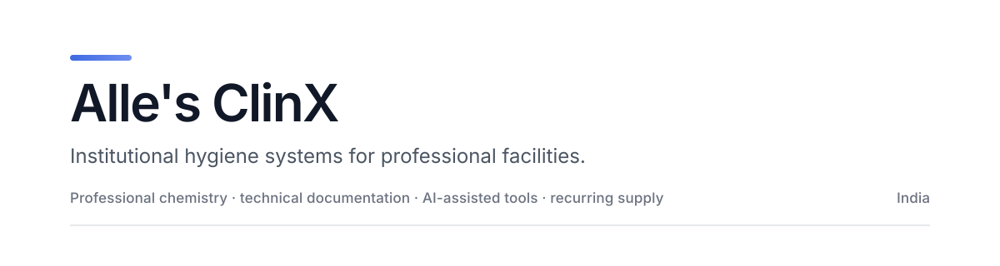

  

  <a href="https://allesclinx.com/">Website</a>
  &nbsp;·&nbsp;
  <a href="https://allesclinx.com/shop/">Products</a>
  &nbsp;·&nbsp;
  <a href="https://allesclinx.com/solutions/">Solutions</a>
  &nbsp;·&nbsp;
  <a href="https://allesclinx.com/clinxai/">ClinXAi</a>
  &nbsp;·&nbsp;
  <a href="https://allesclinx.com/support/media-documents/">Document Center</a>
  &nbsp;·&nbsp;
  <a href="https://allesclinx.com/support/">Support</a>

---

## Alle's ClinX at a glance

<table>
<tr>
<td width="25%"><strong>Institutional focus</strong> Built for professional facilities rather than consumer retail.</td>
<td width="25%"><strong>Documentation-led</strong> SDS, TDS, SOPs, usage guidance and operating resources.</td>
<td width="25%"><strong>Digital systems</strong> ClinXAi, Nova, Metricon and facility planning tools.</td>
<td width="25%"><strong>India</strong> Designed around institutional procurement and operating conditions.</td>
</tr>
</table>

**Alle's ClinX** is a B2B institutional hygiene brand operated by **Champaran Innovatives Private Limited**. We develop professional cleaning chemistry and connect it with technical documentation, decision tools and recurring supply systems for healthcare, education, hospitality and industrial facilities.

The objective is straightforward: make institutional hygiene easier to specify, safer to use and more consistent to operate.

## Core systems

<table>
<tr>
<td width="50%" valign="top">

### Professional chemistry

Institutional cleaning and hygiene formulations supported by dilution guidance, product documentation and operating procedures.

[Explore products →](https://allesclinx.com/shop/)

</td>
<td width="50%" valign="top">

### ClinXAi

The digital intelligence layer around the Alle's ClinX system, connecting product knowledge, procurement support and institutional operating tools.

[Explore ClinXAi →](https://allesclinx.com/clinxai/)

</td>
</tr>
<tr>
<td width="50%" valign="top">

### Nova

A proprietary AI assistant designed for product, documentation and operational questions grounded in Alle's ClinX information.

[About Nova →](https://allesclinx.com/about-nova/)

</td>
<td width="50%" valign="top">

### Metricon

Public calculators for chemistry, dilution, dosage, cost, consumption and supplier decision-making.

[Open Metricon →](https://allesclinx.com/metricon/)

</td>
</tr>
<tr>
<td width="50%" valign="top">

### Alle's ClinX Plus

A recurring institutional supply system connecting chemistry with planning, execution support and facility-level tools.

[Explore Plus →](https://allesclinx.com/plus/)

</td>
<td width="50%" valign="top">

### Facility intelligence

Supply Planner, Hygiene Passport and Facility Tools help teams structure recurring chemical use and operating information.

[Supply Planner](https://allesclinx.com/plus/supply-planner/) · [Hygiene Passport](https://allesclinx.com/plus/hygiene-passport/) · [Facility Tools](https://allesclinx.com/plus/facility-tools/)

</td>
</tr>
</table>

## Public technical library

This GitHub organization maintains a public, version-controlled mirror of selected Alle's ClinX technical and operational documentation.

| Collection | Current public PDFs | Purpose |
| --- | ---: | --- |
| [Safety Data Sheets / MSDS](https://github.com/alles-clinx/.github/tree/main/sds) | 36 | Safety, handling, storage and hazard information |
| [Technical Data Sheets](https://github.com/alles-clinx/.github/tree/main/tds) | 35 | Product characteristics and technical reference |
| [Product SOPs](https://github.com/alles-clinx/.github/tree/main/sops) | 35 | Repeatable operating procedures |
| [Product Usage Guides](https://github.com/alles-clinx/.github/tree/main/usage-guides) | 35 | Dilution and application guidance |
| [Facility Hygiene Resources](https://github.com/alles-clinx/.github/tree/main/resources) | 51 | Checklists, logs, templates and operational tools |

**192 public PDFs are currently mirrored in this repository.**

[Browse the complete document index →](https://github.com/alles-clinx/.github/blob/main/DOCUMENTS.md)

## Designed for institutional environments

<table>
<tr>
<td width="25%"><strong>Healthcare</strong> Surface hygiene, housekeeping, chemical control and documentation.</td>
<td width="25%"><strong>Education</strong> Daily cleaning systems for schools, campuses and shared facilities.</td>
<td width="25%"><strong>Hospitality</strong> Guest-area, washroom, kitchen and back-of-house hygiene.</td>
<td width="25%"><strong>Industry</strong> Facility cleaning, degreasing and recurring chemical management.</td>
</tr>
</table>

## Corporate identity and references

| Field | Official information |
| --- | --- |
| Brand | **Alle's ClinX** |
| Legal operator | **Champaran Innovatives Private Limited** |
| Country | India |
| Business category | B2B institutional hygiene systems and professional cleaning chemicals |
| Official website | https://allesclinx.com/ |
| GitHub organization | https://github.com/alles-clinx |
| LSEG PermID | 6000375462 |
| LSEG ORG ID | 128194246 |
| S&P Capital IQ company ID | 2018713108 |
| S&P Global company profile ID | 150390290 |

For structured entity information, see the [official entity reference](https://github.com/alles-clinx/.github/blob/main/ENTITY.md) and [machine-readable organization data](https://github.com/alles-clinx/.github/blob/main/organization.json).

## Official resources

| Resource | Description |
| --- | --- |
| [Who we are](https://allesclinx.com/who-we-are/) | Company identity, operating model and background |
| [What we do](https://allesclinx.com/what-we-do/) | Chemistry, data, AI and institutional supply systems |
| [Solutions](https://allesclinx.com/solutions/) | Sector and facility use cases |
| [Products](https://allesclinx.com/shop/) | Institutional cleaning and hygiene chemistry |
| [Document Center](https://allesclinx.com/support/media-documents/) | Official technical and company documentation |
| [Insights](https://allesclinx.com/insights/) | Institutional hygiene, chemistry and procurement writing |
| [Support](https://allesclinx.com/support/) | Product, ordering and documentation support |

## Operating principles

**Evidence before claims.** Technical information should be traceable and clearly communicated.

**Safety close to the product.** Compatibility limits, PPE, storage information and operating guidance should be easy to find.

**Repeatable systems over guesswork.** Institutional hygiene improves when procedures are simple enough to execute consistently.

**Useful documentation.** Technical resources should help operators, procurement teams, auditors and safety professionals make better decisions.

## Support and safety

Product care: [care@allesclinx.com](mailto:care@allesclinx.com)  
Procurement: [procurement@allesclinx.com](mailto:procurement@allesclinx.com)  
Official website: [allesclinx.com](https://allesclinx.com/)

> Information published here supports professional decision-making but does not replace the current product label, Safety Data Sheet, Technical Data Sheet, applicable regulation or an institution's approved operating procedure. Never mix chemical products unless official documentation explicitly permits it.

---

  <strong>Alle's ClinX</strong> 
  A brand of Champaran Innovatives Private Limited, India.

